<!--
  GitHub profile README for KevenGoncalves/KevenGoncalves.
  The banner and contact cards are generated from the portfolio: `pnpm build && pnpm github:banner` (scripts/github-banner.mjs).
  TODO: replace https://kevengoncalves.example with the portfolio's real address once it's deployed (banner link + portfolio card).
-->

<p align="center">
  <a href="https://kevengoncalves.example">
    
  </a>
</p>

---

### `01` &nbsp;About

I'm a developer driven by curiosity about how things really work — from the low-level details all the way up to the high-level design. I love digging deep to understand a system inside and out, then using that knowledge to build great things for great people.

Currently a **Software Developer at Cornelder de Moçambique**, building fast, reliable native mobile apps — implementing **OCR solutions** in our mobile apps and building **internal SDKs**. Before that I worked mainly as a **full-stack developer** for both established companies and startups, taking features from the database all the way to the interface.

```kotlin
object Keven {
    val location   = "Beira, Mozambique 🇲🇿"
    val role       = "Software Developer @ Cornelder de Moçambique"
    val focus      = listOf("Native Android & iOS", "OCR on mobile", "Internal SDKs", "Backend", "LLM-powered tools")
    val education  = "BSc Computer Engineering — Universidade Zambeze (2025)"
    val languages  = listOf("Portuguese (native)", "English")
    val funFact    = "Captained Mozambique's national robotics team at the FIRST Global Challenge 2019 🤖"
    val offline    = "Family time and my beloved video games 🎮"
}
```

### `02` &nbsp;Stack

<table>
  <tr>
    <td><b>Mobile</b></td>
    <td></td>
  </tr>
  <tr>
    <td><b>Backend</b></td>
    <td></td>
  </tr>
  <tr>
    <td><b>Frontend</b></td>
    <td></td>
  </tr>
  <tr>
    <td><b>Data</b></td>
    <td></td>
  </tr>
  <tr>
    <td><b>Tooling</b></td>
    <td></td>
  </tr>
</table>


### `03` &nbsp;GitHub

<p align="center">
  
  
</p>
<p align="center">
  
</p>

### `04` &nbsp;Let's talk

Have a project in mind, a role to fill, or just want to talk tech? My inbox is open.

<p align="center">
  <a href="mailto:keven.jm.goncalves@gmail.com"></a>
  <a href="https://www.linkedin.com/in/keven-gon%C3%A7alves-5867661a9/"></a>
  <a href="https://kevengoncalves.example"></a>
</p>

<p align="center"><sub>I make <b>sauce</b>, but not in the kitchen.</sub></p>
